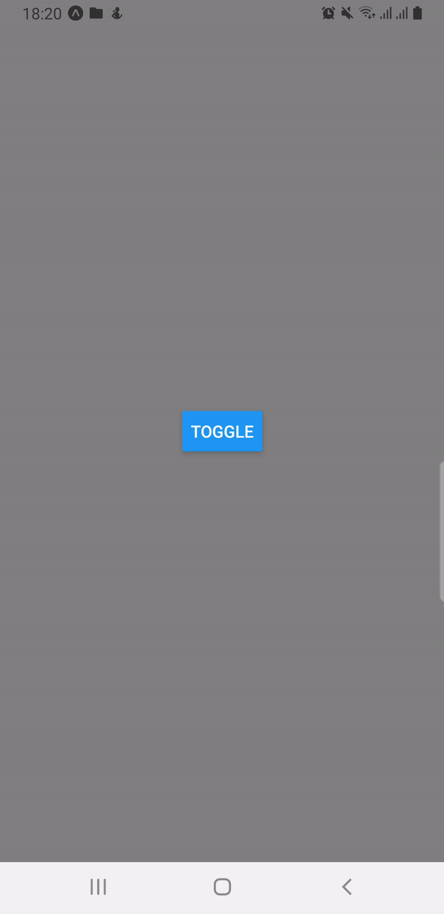

# React Native Reanimated Bottom Sheet

This mini project aims to be a single and simple component for react-native applications. It provides a clear, configurable, and customizable bottom sheet imitating native bottom sheet behavior, built from scratch with no extra native dependencies, to overpower it and speed up the development process.


  |
:---------------:|


## Prerequisites

- [Node.js > 12](https://nodejs.org)
- [react native 0.70](https://reactnative.dev/docs/0.70/environment-setup)
- [Expo](https://docs.expo.dev/)
- [JDK > 11](https://www.oracle.com/java/technologies/javase-jdk11-downloads.html)
- [Android Studio and Android SDK](https://developer.android.com/studio)

## Base dependencies

- [react-native-reanimated](https://www.reanimated2.com/) to create smooth animations and interactions that runs on the UI thread.
- [react-native-gesture-handler](https://github.com/luggit/react-native-config) to replace React Native's built in touch system called Gesture Responder System.

## Installation

Open a Terminal in the project root and run:

```sh
npm install
```

Or if you want to create your own project make sure to install the following dependencies [`react-native-gesture-handler`](https://github.com/kmagiera/react-native-gesture-handler) and [`react-native-reanimated`](https://github.com/kmagiera/react-native-reanimated).

If you are using Expo, to ensure that you get the compatible versions of the libraries, run:

```sh
expo install react-native-gesture-handler react-native-reanimated
```

If you are not using Expo, run the following:

```sh
yarn add react-native-reanimated react-native-gesture-handler
```

Or if you use npm:

```sh
npm install react-native-reanimated react-native-gesture-handler
```
Make sure to add the following plugin in babel.config.js

```javascript
presets: ['babel-preset-expo'],
plugins: [
    'react-native-reanimated/plugin',
],
```

We're done! Now you can build and run the app on your device/simulator.
